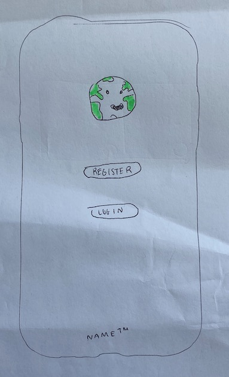
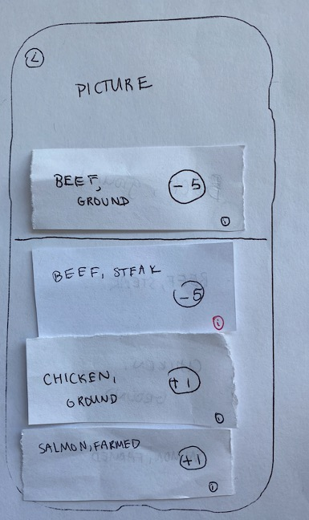
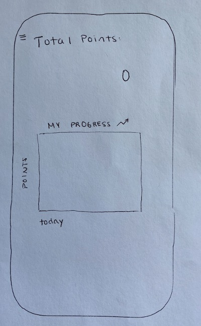

# Teco 

## Problem & Related Work
Our project aims to address the issue of waste and pollution on an individual level. We believe that this problem is important because the waste US produces is equivalent to 11 percent of greenhouse gas emissions, according to the WWF.  Waste is an interesting problem space because it can be mitigated by small everyday decisions that don’t require a whole lot of effort. Currently, according to the World Bank, the average person creates about 4.5 kilograms of waste a day. Additionally food waste accounts for 30 to 40 percent of our food supply, which is extremely water, energy, and land costly. We believe this problem is worthwhile because our solution will be highly scalable and will have large impacts if done collectively in communities. Through our solution, we want to increase awareness about unnecessary consumption waste and with increased user engagement, lead to community’s reduction of waste.
We believe many waste generated from consumption can be reduced if we educate people about how much consumerism has negatively impacted the environment and the alternative actions they could take to reduce waste. Currently there are many sustainable mobile applications and websites that do a great job educating people to living a more environmentally friendly lifestyle. For example, iHuerting is an app that guides users to build an organic urban garden from scratch. Oroeco calculates users’ daily carbon footprint and educates people about climate change. Our application would be in similar style as Oroeco. However, unlike Oroeco which calculates carbon footprint for all aspects of an individual’s life, we want our app to only focus on the consumption one does on a daily basis. We believe narrowing the target down to daily consumption could motivate users to use the app more frequently. We also believe that this would address the variance in consumer behaviors. This would also allow us to design more intricate features, such as a recommendation system based on user’s entry, that could give users more guidance on how to become more environmentally friendly. Our app will contain a database on different kinds of products and their corresponding carbon footprint. However, the computation and data used within the app can only calculates one’s carbon footprint. Through a point system for consumer choices can be both accessible and motivating, it does not guarantee behavioral change, which is one of the pitfalls of computing in solving issues of sustainability.
We chose to make these calculations on a daily basis as opposed to a yearly average because we don’t believe that all users will make perfect choices. In other words, some people will cut down on their red meat consumption, but they wouldn’t be able to say they gave up red meat completely. Allowing point values to be given on a daily basis allows people to cut down on poor consumer choices without eliminating them entirely, because we see this to be infeasible to expect of users. Furthermore, letting users reflect upon impacts of their daily decisions will motivate them to consistently use our solution and make a meaningful impact collectively.

## User Research
### Prior to interviews, we planned and considered many assumptions: 
I think we are assuming that people care about environmental issues, i.e. that they would change their behavior if they learned about its impacts.
We will interview people by asking them about their purchase patterns and whether they would be interested in changing their purchase patterns to reduce their carbon footprint. 
We will find people to interview through classes, extracurricular activities, organizations we are a part of on campus, family and friends.
We will make the interviews partly task oriented to inform our design decisions, but also partly traditional Q&A about general consumer patterns to help inform decisions about our problem space
Our core objective is to Raise awareness of consumption waste through tracking; offer alternative solutions
Our core obstacles for this objective deal with users not having the time, not having the information, or not having the money.
We assume that people will be willing to consistently log in their purchases and change their purchase habits by using our app. 
The potential users can be people of all age groups. However, we want to take into consideration different age groups when creating the alternative product recommendation system because we don’t want to recommend products that are outside of our users ability to purchase. 
If we could find users of iHuerting or Oroeco, we can try observing when and how they use these apps.  
Some practices we could observe people doing are people’s choices of products in grocery stores. We can observe if people are conscious of waste by looking if people are more likely choose eco-friendly goods or not.
It might be helpful to compare the sales of two products with the same price/feature when one is advertised as eco-friendly to observe how much environmental concerns impact consumer choices.

### After interviewing, we gathered the following takeaways:
Our target users are people aged 20 to 40 because we believe they are the majority of the consumers with purchasing power.
We need to be able to accommodate users of different backgrounds, especially when it comes to pricing of alternatives and users with dietary restrictions.
100% of our interviewees said that they did not think about the carbon footprint of the food they buy. 
4 out of 6 interviewees selected dairy milk. After being told that dairy milk contributes to your annual carbon footprint by 131 kg, compared to 29 kg and 40 kg for almond and soy milk, respectively, 3 out of 4 chose milk alternatives.
 For meats, 5 out 6 interviewees selected chicken and stayed with it, citing it as the second best option for protein (tofu was the first). 
Cost, location, and ease of consumption affect people’s food consumer choices.
Users need cost-effective ways to cut down on the carbon footprint of the food they buy without requiring large amounts of effort.
We need to provide an alternative option while reassuring the users that changing to the alternative option will not be a hassle
Further research will be necessary to explore other potential solutions for making user behavior change easier.
learning about alternative options is a complex task because it requires additional time to be allocated by the user. However, being too busy as a root cause for not taking consideration of consumption waste is an assumption because the user may have no genuine interest in reducing waste.

## Paper Prototyping

### Screenshots

#### Summary
Overall, our concept was received generally well by testers, with a few usability problems. The main upside to our concept was that the major parts of our app were intuitive to use. For example, the trivia game was intuitive enough for the user to complete the task. Also, users intuitively understood that the higher the point is for a food item, the better the item is to the environment.

#### Usability Problems
The first usability problem that we encountered was that users did not understand they were supposed to search for food items on the home page. This was due to a lack of visibility on the home page; the home page did not help users understand what features are available, what the current state of the system is, and their current navigational system. The lack of visibility most likely made the app unintuitive for users.

Another usability problem that we discovered was that the sidebar icon was not conspicuous enough for users to click on it. As a result, one of our users was not able to find the trivia section of the app. Again, this was an issue with visibility; it was not clear what features are available to access from the home page.

#### What We Learned and What We Did
Based on what we learned from our testers, we decided to add a welcome page that would make the functionality of our app clear. The welcome page had a “Search” button, a “My Points” button, a “My Shopping List” button, and a “Trivia” button. Ultimately, we chose to remove the welcome page and revert to the sidebar implementation after further feedback and development. 

## High-Fidelity Prototyping

### Task 1

#### Scenario
Robert is an undergraduate student at Northwestern. He wants to have a burger for dinner tonight but he doesn’t have any ingredients at home. Before his shopping trip, Robert wants to make sure that he is making environmentally conscious decisions when purchasing the ingredients. So he turns to our app for help. 

#### Implementation
For this task we implemented a **Home Page**, where users can select which component they want to navigate to easily after launching the app. Without having to open the sidebar, the users can quickly choose which component of the app they want to access. The home page will have four buttons: search, my points, my shopping list, and my daily trivia. Clicking each button will navigate the users to the corresponding components.

We also implemented a **Search Page**, where users can search food by name (e.g. beef) or category (e.g. meat) to look up how much carbon footprint the food has. This is our interactive data filter component that filters our food data based on the search term inputted by the user. Each food card displays its picture, name, carbon footprint, points given if selected for purchase, and an add to cart button. Clicking the add to cart button will add the food item into the cart and navigate the users to the shopping cart component. For the first task, Robert wants to learn more about the ingredients for a burger. He would go to the search page of our app and search for buns and ground meat. Below are screenshots of the options he gets from our app. 

   

Lastly we implemented a **Shopping Cart**, where users can navigate to the shopping cart through the introduction page or the app sidebar when they swipe left to right. The shopping cart displays all the products that the user selected through searches, along with the points associated with each product in the cart. A point total is calculated at the end of the cart. Users can choose to add more items to the cart, record the point total of the products in the cart, or empty the cart. 

### Task 2

#### Scenario
James is having dinner at a restaurant with his friends. James is struggling to decide between steak or salmon, as he does not know which option is the more environmentally-friendly and/or healthy option. James decides to use our app to help him out. 

#### Implementation
For this task we implemented an **Item Page**. After searching food items by name (e.g. beef or salmon) or category (e.g. meat or fruit), users will encounter a list of food cards. Selecting a food card will navigate the user to the item page, which contains detailed information about that specific food option. Each food card contains information about nutrition, such as serving size, calories, and macros, as well as a carbon footprint value and point value. There will also be food cards of alternative options below the selected food card.

   

In this round of prototype we added modifications to our Shopping Cart component. Now users can now delete individual food selections from their shopping cart as well as clearing the entire shopping cart. To delete an individual food item from the shopping cart, users can press the “minus” button on each food card. To clear the entire shopping cart, users can press “clear cart” on the bottom of the page. 

   

### Task 3

#### Scenario
James is a new user who likes to play games and wants to learn more about the carbon footprints of different food products. He wants to try out the trivia section of our app.

#### Implementation
For task 3 we implemented a new component called **Trivia**. Users can play a trivia game and test their knowledge of the environmental impact of common foods. Users are presented with two food pictures and asked “Which one [food] is better for the environment?”. Users select the food that they think is correct; if they are correct, they get a “correct” prompt, and if they are incorrect, they get an “incorrect” prompt. Users are also shown the carbon footprints of the respective foods in the prior round. Users can select the “next round” button to proceed to the next round. This satisfies the Gamification component requirement.

      

### Final Improvement
For the final round of prototype we incorporated suggestions received from the last in-class demo session and modified the My Points page of our application. As shown in the image below, we now added an analogy of 40 points equals saving one tree to keep the users motivated to select eco-friendly products and to continue to use our application. We also removed some excessive white space on the page to make the page look more clean. 

### Three components

We incorporated the concept of gamification in the design of the Trivia page. Users will learn more about the carbon footprint of specific products by playing the trivia game. When they get a question right, they get a positive reward and when they get the question wrong, they get a negative reward. The reward is expressed in terms of the number of points shown on the screen. 

## Reflection

With the time we had we were able to implement the Search Page, Shopping Cart, Item Page, Trivia, and My Points. We also initially implemented the Home Page, but it was removed during the design process as we considered the feedback and the design principles as we continued development. The core features necessary to carry out the tasks we aimed to accomplish with our paper prototypes were all implemented so that our computer prototype can satisfy all tasks and scenarios we came up with. All the intended interactions for existing pages/components were implemented successfully. After the implementation for task 3, we added one more feature based on our observation and user testing. We enhanced the My Points to have additional gamification aspect. My Points was not necessary to complete our tasks, but we found that additional changes to this page can make it more attractive for users. My Points exhibits not only the aggregate points gained by from all the various shopping carts the user created, but it also exhibits how the points the user collected translates to trees saved. With the design principles in mind, we complemented the text with a tree image to let users have a closer feeling of satisfaction as they review how many points they have collected so far.

The next steps for the application if more time was allowed will be to add more gamification aspects to the app. We currently do have a point system that shows users how much they saved through their purchasing decisions. Furthermore, we have our trivia feature that allows them to play a simple quiz game to learn about sustainability. However, it will be helpful to add a competitive aspect in this app. We can build a community feature first with authentication (sign-in) so that we can store data for individual users. Once that is complete, we can have a new page with a leaderboard component. This component would display ranked points of all users using our app. We can base the ranked lists based on location or other factors such as similar diet. This feature can be enhanced by elaborating on the authentication component. With sign-in built in, we can create another page that allows users to add "friends". Through this component, the competitive leaderboard feature can be further personalized for each user by letting them compete with friends. This will make the gamification aspect of our app stronger and increase user compliance. In order to make change with this app, consistent usage from users are required. Therefore, any features that will help users visit this app more often will be significant.

We can also improve the gamification aspect of My Points that was implemented after our Task 3 implementation process. Currently forty points are translated into saving one tree. This could be modified so that there is a better way for users to track progress. The design can be modified so that instead of rendering a full tree, different growth stages of a tree can be rendered. For instance, as users collect more points, the tree will "grow". Once the user collects all forty points, the tree will go back to its early stage while the counter for number of tree saved increases. This will provide users more satisfaction as they check their points as they can translate their good decisions marked by points to the growth of a virtual tree.

Other than the gamification aspect, we can construct our own API and database with more food data. Existing databases we found were insufficient to meet our needs. Therefore, we will have to use a combination of existing API's to pull some information and supplement them with our own research. Though this may not seem scalable, if we can identify websites with good quality of food data with carbon footprint information, the process can be accelerated through web scraping. All the potential features mentioned above will need multiple user testing as user interface and user experience are critical for our app's user compliance.

## Links

[Link](https://github.com/CS330HCI/Group1) to our team's Github repository

[Link](https://drive.google.com/open?id=1qpgAHLAk530UY_Ehy229sWd_4fxLMdKT) to video of our final prototype

### How to view the application
To view our application, please follow the following steps to install expo on your laptop. Once the expo server is started, the app can be viewed on your mobile device. 
- pull from our github repository
- make sure to have nodejs10 LTS installed on your laptop
- run "npm install -g expo-cli" in terminal
- in your terminal go to Group1/argon-react-native-master
- within that directory run "npm install"
- run "npm install --save react-native-gesture-handler react-native-reanimated react-native-screens"
- run "npm start" or “expo start”
- make sure to have the Expo Client application installed on your phone
- use the camera app on your phone to scan the QR code shown on your terminal
- You should be able to see our app on your phone

