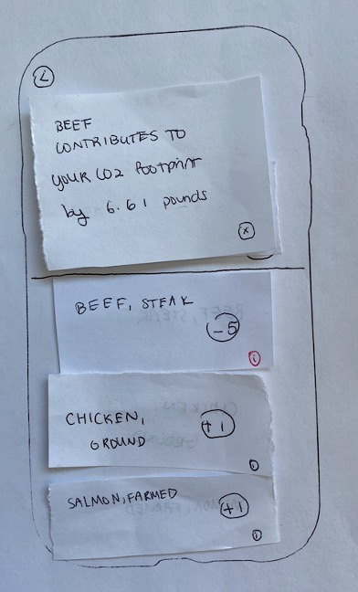

# Teco 

## Paper Prototyping

### Screenshots

#### Summary
Overall, our concept was received generally well by testers, with a few usability problems. The main upside to our concept was that the major parts of our app were intuitive to use. For example, the trivia game was intuitive enough for the user to complete the task. Also, users intuitively understood that the higher the point is for a food item, the better the item is to the environment.

#### Usability Problems
The first usability problem that we encountered was that users did not understand they were supposed to search for food items on the home page. This was due to a lack of visibility on the home page; the home page did not help users understand what features are available, what the current state of the system is, and their current navigational system. The lack of visibility most likely made the app unintuitive for users.

Another usability problem that we discovered was that the sidebar icon was not conspicuous enough for users to click on it. As a result, one of our users was not able to find the trivia section of the app. Again, this was an issue with visibility; it was not clear what features are available to access from the home page.

#### What We Learned and What We Did
Based on what we learned from our testers, we decided to add a welcome page that would make the functionality of our app clear. The welcome page had a “Search” button, a “My Points” button, a “My Shopping List” button, and a “Trivia” button. Ultimately, we chose to remove the welcome page and revert to the sidebar implementation after further feedback and development. 

## High-Fidelity Prototyping

### Task 1

#### Scenario
Robert is an undergraduate student at Northwestern. He wants to have a burger for dinner tonight but he doesn’t have any ingredients at home. Before his shopping trip, Robert wants to make sure that he is making environmentally conscious decisions when purchasing the ingredients. So he turns to our app for help. 

#### Implementation
For this task we implemented a **Home Page**, where users can select which component they want to navigate to easily after launching the app. Without having to open the sidebar, the users can quickly choose which component of the app they want to access. The home page will have four buttons: search, my points, my shopping list, and my daily trivia. Clicking each button will navigate the users to the corresponding components.

We also implemented a **Search Page**, where users can search food by name (e.g. beef) or category (e.g. meat) to look up how much carbon footprint the food has. Each food card displays its picture, name, carbon footprint, points given if selected for purchase, and an add to cart button. Clicking the add to cart button will add the food item into the cart and navigate the users to the shopping cart component. For the first task, Robert wants to learn more about the ingredients for a burger. He would go to the search page of our app and search for buns and ground meat. Below are screenshots of the options he gets from our app. 

   

Lastly we implemented a **Shopping Cart**, where users can navigate to the shopping cart through the introduction page or the app sidebar when they swipe left to right. The shopping cart displays all the products that the user selected through searches, along with the points associated with each product in the cart. A point total is calculated at the end of the cart. Users can choose to add more items to the cart, record the point total of the products in the cart, or empty the cart. 

### Task 2

#### Scenario
James is having dinner at a restaurant with his friends. James is struggling to decide between steak or salmon, as he does not know which option is the more environmentally-friendly and/or healthy option. James decides to use our app to help him out. 

#### Implementation
For this task we implemented an **Item Page**. After searching food items by name (e.g. beef or salmon) or category (e.g. meat or fruit), users will encounter a list of food cards. Selecting a food card will navigate the user to the item page, which contains detailed information about that specific food option. Each food card contains information about nutrition, such as serving size, calories, and macros, as well as a carbon footprint value and point value. There will also be food cards of alternative options below the selected food card.

   

In this round of prototype we added modifications to our Shopping Cart component. Now users can now delete individual food selections from their shopping cart as well as clearing the entire shopping cart. To delete an individual food item from the shopping cart, users can press the “minus” button on each food card. To clear the entire shopping cart, users can press “clear cart” on the bottom of the page. 

   

### Task 3

#### Scenario
James is a new user who likes to play games and wants to learn more about the carbon footprints of different food products. He wants to try out the trivia section of our app.

#### Implementation
For task 3 we implemented a new component called **Trivia**. Users can play a trivia game and test their knowledge of the environmental impact of common foods. Users are presented with two food pictures and asked “Which one [food] is better for the environment?”. Users select the food that they think is correct; if they are correct, they get a “correct” prompt, and if they are incorrect, they get an “incorrect” prompt. Users are also shown the carbon footprints of the respective foods in the prior round. Users can select the “next round” button to proceed to the next round. This satisfies the Gamification component requirement.

      

